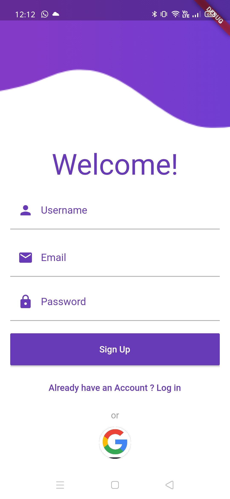
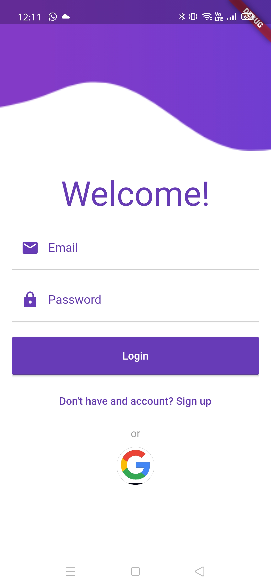
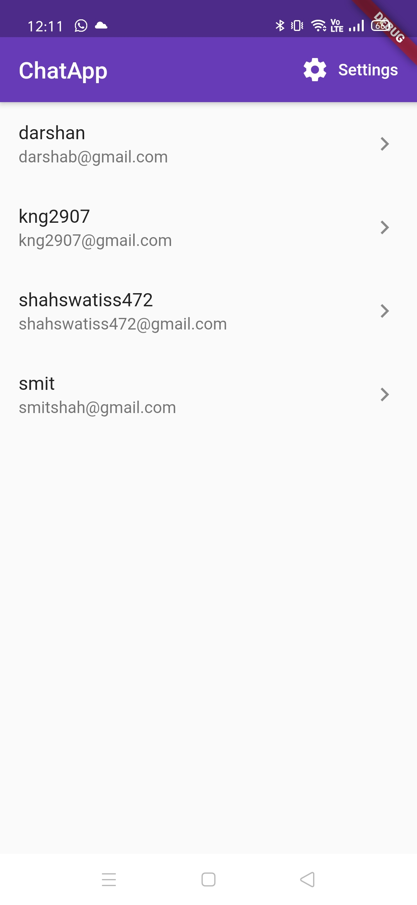
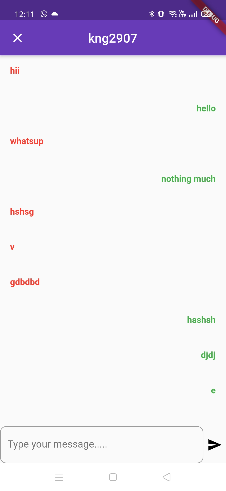
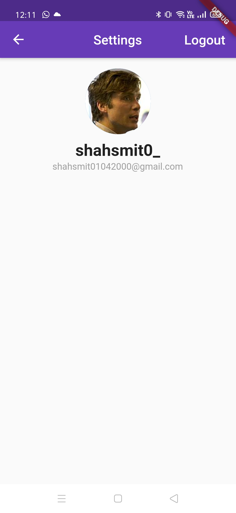

<div align="center">

# Chat Application
[](https://flutter.dev/)
[](https://firebase.google.com/)
[](https://code.visualstudio.com/  "Visual Studio Code")
</div>

## Sign Up Page



## Login Page



## Home Page



## Chat Screen Page



## Settings Page



#### How to Run- 

```html
Download the app-debug.apk file in \build\app\outputs\apk\debug
```

###  Tech stack
`Implemented on` : Visual Studio  <br>
`Language` : Dart<br>
`Framework` : Flutter <br>
`Database and Authentication` : FireBase <br>

## To develop further

- [ ] Add `follow` feature where user can message to only those users who he/she follows
- [X] Fixing `signup` bug
- [ ] Adding a feature that allows user to `delete` their message
